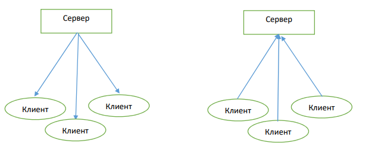

# EventEmitter. Событийная модель построения приложений 

1. Создайте событие, обработчик и эмиттер события через библиотеку Events.
2. Создайте свой класс MyEmitter который будет наследоваться от класса
EventEmitter и создайте событие, обработчик и эмиттер от класса MyEmitter. 
3. Расширьте класс MyEmitter добавив в него событие “Any events”, который
запускается от эмитта любого события.
4. Напишите свой класс EventEmitter, который потом будет использоваться как
родительский класс для MyEmitter.
5. Создайте событие error, который будет принимать экземпляр класса Error с
сообщением об ошибке.
6. Ознакомьтесь с понятием «Событийная модель построения приложения»
(теория).
7. Напишите чат используя TCP протокол и событийную модель построения
приложения. Должно быть написано два файла, сервер и клиент. Сервер
запускается на одном и компьютеров, а клиентские программы запускаются
на всех остальных компьютерах и пишут сообщения серверу, а сервер
пишет сообщения для всех клиентов. 

